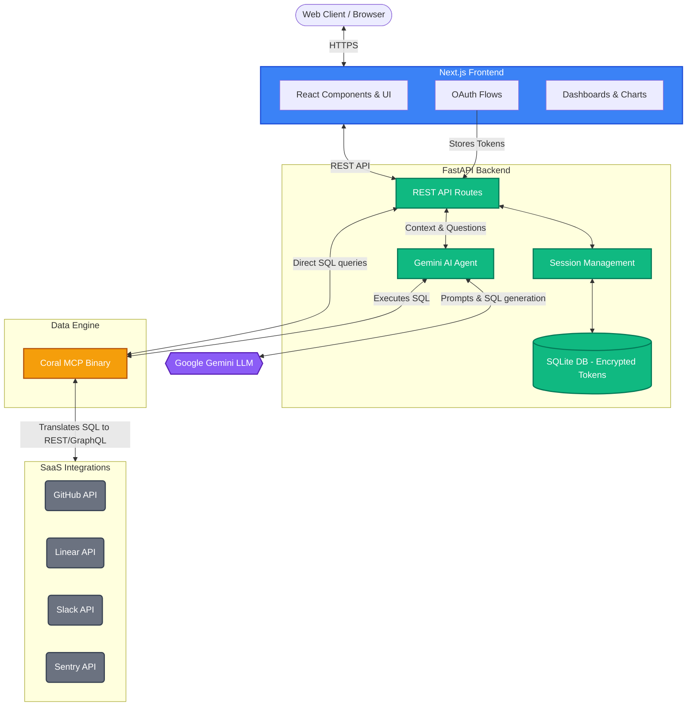

# ⚡ DevPulse

**An Engineering Health Intelligence Platform powered by Coral Federated SQL and Google Gemini AI.**

DevPulse breaks down the data silos between your team's essential tools. By aggregating telemetry across **GitHub**, **Linear**, **Slack**, and **Sentry** in real-time using Coral's federated SQL engine, DevPulse provides engineering managers and developers with a single pane of glass to view sprint health, error trends, team velocity, and blockers.

## ✨ Key Features

- **Automated Morning Standup Digests**: Start your day with an AI-generated synthesis of what's blocked, what's shipping, and what's broken, pulling data directly from live APIs.
- **Natural Language to SQL**: Ask questions in plain English (e.g., "Show me all in-progress Linear issues and their linked GitHub PR status") and watch Gemini generate the Coral SQL to fetch your answers.
- **Cross-Source JOINs**: Seamlessly JOIN data from different SaaS platforms without moving a single byte of data into a warehouse.
- **Zero-ETL Architecture**: No data pipelines to maintain. We query live APIs via Coral, ensuring data privacy and real-time accuracy.

---

## 🏗️ System Architecture

DevPulse uses a modern, serverless-friendly architecture built on Next.js, FastAPI, and Coral MCP.



## 🔄 Data Flow

1. **Authentication**: Users securely connect their integrations via OAuth from the Next.js frontend.
2. **Storage**: The FastAPI backend encrypts and stores the integration tokens in a local SQLite database.
3. **Execution**: When a user opens the Morning Standup dashboard or asks a question:
   - The backend retrieves and injects the user's decrypted tokens into the environment.
   - The Gemini AI agent generates the appropriate SQL query.
   - The query is executed via the **Coral** binary over MCP (Model Context Protocol).
4. **Federation**: Coral intercepts the SQL, translates it into optimal REST/GraphQL API calls for GitHub, Linear, Slack, and Sentry.
5. **Synthesis**: The raw tabular data is returned to the backend, where Gemini synthesizes it into human-readable insights.
6. **Rendering**: The frontend renders the unified insights and charts.

---

## 🛠️ Tech Stack

- **Frontend**: Next.js (React), TailwindCSS, Recharts
- **Backend**: FastAPI (Python), SQLite, Pydantic
- **Data Engine**: Coral (Federated SQL Engine via MCP)
- **AI & LLM**: Google Gemini
- **Deployment**: Google Cloud Run

---

## 🚀 Getting Started

### Prerequisites
- Node.js v18+
- Python 3.10+
- A Google Gemini API Key

### 1. Backend Setup

```bash
cd backend
python -m venv venv
source venv/bin/activate  # Or `venv\Scripts\activate` on Windows
pip install -r requirements.txt
```

Create a `.env` file in the `backend` directory (see `.env.example` for required variables).

Start the FastAPI server:
```bash
uvicorn main:app --reload --port 8000
```

### 2. Frontend Setup

```bash
cd frontend
npm install
```

Start the Next.js development server:
```bash
npm run dev
```

### 3. Usage
Navigate to `http://localhost:3000` in your browser. Connect your integrations from the Settings page and start querying your engineering data!

---

## ☁️ Deployment

**Backend (Cloud Run)**:
```bash
cd backend
gcloud run deploy devpulse-backend --source .
```

**Frontend (Cloud Run)**:
```bash
cd frontend
gcloud run deploy devpulse-frontend --source .
```
